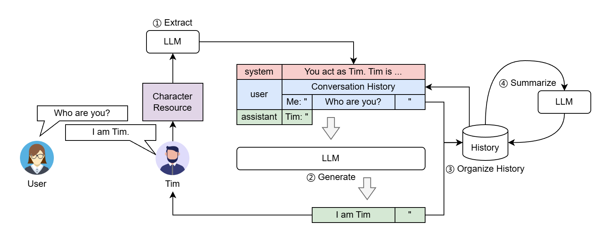

# CS4314 NLP

Goal: Fine-tune a LLM and then make it role-play.

目标：在指令数据集上微调一个大语言模型，然后让它能够角色扮演

## Finetune 微调

Base model: [Qwen-2.5-3B](https://huggingface.co/Qwen/Qwen2.5-3B)

Platform: A100 80G x1

Time: 3 hrs

Dataset: [Alpaca-Cleaned](https://huggingface.co/datasets/yahma/alpaca-cleaned)

LoRA


Example:

```python
{
    'input': "<|im_start|>system\nYou are a helpful assistant.<|im_end|>\n<|im_start|>user\nGive three tips for staying healthy. <|im_end|>\n<|im_start|>assistant\n", 
    'output': "1. Eat ... leep each night.<|endoftext|>"
}
```

## Role-play 角色扮演



### 1 Problem 问题

我们的模型已经具备了指令跟随的能力，现在我们想让模型具备角色扮演的能力。

角色扮演的核心挑战包括：

- 如何使聊天机器人能够以特定身份的虚拟角色进行对话？
- 如何使聊天机器人具备“记忆”功能，能够回忆起超出模型输入序列长度的长期对话内容？
- 如何评估虚拟角色在角色扮演中的表现效果？

### 2 Out methods 方法

#### 2.1 Overview

我们的方法设计遵循以下几个原则：

- 最后考虑监督微调：先仅找到效果较好的纯推理方案，即只利用 LLM 的上下文学习能力的方案，最后再根据找到的方案构造相应的数据集进行监督微调。这样做可以保证这个方案能最大化利用模型原有的能力，而不是一味地增加新的能力。
- 训练与推理的一致性：确保 LLM 在推理过程中的输入输出模式与训练阶段保持一致。
- 强鲁棒性：确保 LLM 在各种条件下均能稳定输出，尽可能避免其受到噪声的干扰。

基于上述原则，我们提出了 **EGOS**（Extract, Generate, Organize, and Summarize）LLM 角色扮演方法，顾名思义，该方法由四个步骤构成。该方法是一个纯推理方案，但是可以很方便地与微调相结合。EGOS 方法要求模型具备基本的单轮指令跟随能力。

#### 2.2 Extract

Extract 步骤在开启对话前，也可以在每轮对话中，取决于实现方案。在这一步骤里，我们从所给虚拟角色的各类资源中提取角色设定。这些资源可以包括百科式介绍，角色与他人对话的记录，以及角色所处的世界观等。我们通过设定合适的提示词，借助外部或内部 LLM 进行信息提取。提取的核心信息包括角色名称、背景、性格特征及示例对话。此步骤的一个目的是对大量信息进行总结和提炼，以节省后续模型的输入长度；另一个目的是去除噪声，以避免对后续 LLM 的输出造成干扰。

关于 Extract 的具体实现我们考虑了两种方案，一种是静态总结式，一种是动态检索式。

- 静态总结式：预先给定资料，让 LLM 做总结提炼。如果资料超出 LLM 最大输入长度，则将资料进行切分，迭代地完善提取的信息。提取出的信息在整个对话中不变。
- 动态检索式：利用之前的 RAG 方案，将资料转化为数据库，根据每个对话所要用到的信息，去数据库中检索相关的信息。提取出的信息只在一轮对话中有效。

#### 2.3 Generate

开启对话后，用户每问一个问题，会触发 Generate 步骤。

在 Generate 步骤中，首先会构造 prompt。这个 prompt 遵循 system, user, assistant 三角色单轮对话模型来构造，并使用 chat template。

system prompt 包含上一步提取到的角色核心信息，以及需要 LLM 完成的任务概述。在 system prompt 中，我们会告诉 LLM 输入输出的必须要遵守的规则。

user prompt 包含对话信息，包括对话历史（第一轮对话时对话历史为空）以及用户的问题。

将 system prompt 和 user prompt 输入模型后，再补充一个前缀，以提示模型生成（见图）。模型输出从引号开始，到引号结束。这是我们方法的一个亮点。对比这两个输入输出模式：

w quote:

```
User: Me: "Who are you?"
Assistant: Tim: "I am Tim." 
```

w/o quote:

```
User: Who are you?
Assistant: I am Tim.
```

我们认为，对于 LLM 来说，w quote 正确输出的难度低于 w/o quote 正确输出的难度。

第一个原因涉及训练与推理的一致性。在预训练的训练集中，这些不同角色之间的对话模式，大多是以引号直接引用的形式呈现的。比如小说文本中的角色口语对话都是遵循这种文本的形式。因此，如果我们在推理中也遵循这一种形式，一来能有效提示 LLM 当前输出的是某个角色的发言，而非“它自己”的话语，而来能让 LLM 输出更好的对话，更贴近口语表述。

从更宏观的角度看，w quote 可以看作对话续写任务，w/o quote 可以看作聊天任务，对话续写能力在预训练过程中已被有效获取，而聊天能力在我们的预训练和监督微调阶段并未得到针对性训练，所以 w quote 的输入输出模式更能发挥 LLM 的能力。

这一点在实验中也得到验证。采用 w/o quote 会导致模型在回答时出现诸如“作为一个 AI 模型...”的幻觉性表述，并且回答较为书面化、正式化。

第二个原因是这样做能保证鲁棒性。在 w quote 中，我们可以用后引号来判断模型输出结束时机，保证了模型只输出一个回答，不包含其他无关信息。

这一点在实验中也有体现，如果我们用结束符 EOS 来判断模型什么时候输出结束，那么经常会发生模型直接无视我们在 system prompt 中给定的规则的情况，比如在一句话说完之后继续输出一些无关信息，或者输出多条对话。如果有了强制截止的手段，可以有效避免此类情况。

因此，EGOS 方法采用 w quote 的输入输出模式。

#### 2.4 Organize & Summarize

当每一轮对话结束时，会进入 Organize 步骤。在这一步里，我们将本轮对话的文本添加到对话历史中。对话历史会作为下一轮对话时 Generate 步骤的输入，以保证对话的连贯性和上下文的一致性。

在这里我们考虑了两种组织对话历史的方案，一种是标准的使用多轮 chat template 的对话历史实现方案，另一种方案是将对话历史全部放入 user prompt：

multiple：

```
User: Me: "What's your favourite food?"
Assistant: Tim: "I really enjoy sushi. How about you?"
User: Me: "I can't resist pizza."
Assistant: Tim: "I find it a bit too greasy for my taste."
```

single：

```
User: Me: "What's your favourite food?" 
      Tim: "I really enjoy sushi. How about you?" 
      Me: "I can't resist pizza."
Assistant: Tim: "I find it a bit too greasy for my taste."
```

我们最终选择了 single。因为 single 可以更好地适配我们在 Generate 步骤中所遵循的对话续写任务范式。此外，考虑到训推一致性，我们在 Alpaca cleaned 的 SFT 中只训练了模型单轮指令跟随的能力，所以 single 更合适。

当对话历史长度超过模型的最大输入长度时，会触发 Summarize 步骤，简而言之，会将对话历史进行总结以减少其长度。在 Summarize 步骤中，我们会丢掉对话历史的文本，取而代之的是一些情景的概括，包括对话双方的角色、话题和角色在对话中说出的关键信息。Summarize 步骤与 Extract 步骤类似，我们也考虑了两种方案，一种是静态总结式，一种是动态检索式。

### 3 Evaluation 测评

#### 3.1 Metrics 测评指标

我们设计了三个维度来测评角色扮演能力：

- 角色一致性 consistency：我们将角色真实的对话与模型生成的对话给 ChatGPT 进行判断，判断哪个对话是生成的，哪个对话是真实的，统计以假乱真的频率。
- 记忆能力 memory：在上一轮对话中给定一些信息，让 LLM 在下一轮中重复这些信息，统计准确率。
- 生成质量 quality：将不同方法生成的对话给 ChatGPT 进行判断，判断哪一个生成质量（流畅度、表达力）更高。

#### 3.2 Case Study 案例研究

我们测试如下方案：

1. EGOS：使用上文介绍的方法
2. EGOS w/o quote：在 Generate 步骤不用带引号输入输出模式
3. EGOS w/o Extract：去掉 Extract 步骤，直接将原始角色资料作为 Generate 步骤的 system prompt

由于缺乏测评数据，我们人工地对具体案例的生成效果，在三个维度上进行评价。

**角色认知**：

EGOS：

```
User: 介绍一下你自己吧！
Assistant: 当然，我是 SOS 团的团长.
User: 你叫什么？
Assistant: 凉宫春日。
```

EGOS w/o quote:

```
User: 介绍一下你自己吧！
Assistant: 凉宫春日：小明，你叫我小明，我就不高兴。
```

EGOS w/o Extract:

```
User: 介绍一下你自己吧！
Assistant: 这是我的『介绍自己』，如果觉得无聊的话可以多看一两眼。
```


我们可以发现，EGOS 的回答基本没有问题。EGOS w/o quote 输出了不符合要求的对话，可能是由于 LLM 无法区分输出的是角色说的话还是作为一个 AI 模型说的话。EGOS w/o Extract 输出了莫名其妙的回复，可能是由于 LLM 受到了来自原始角色资料中的噪声的影响。

**场景对话**：

EGOS：

```
User: 好无聊啊。
Assistant: 喂，怎么样？被『超级无敌超人』这样一个美女盯上了，不是挺棒的嘛！
User: 你也太自以为是了。
Assistant: 那是因为我实在是太棒了！
```

EGOS w/o quote:

```
User: 好无聊啊。
Assistant:
场景：现在小明和凉宫春日刚刚见面
好无聊啊。自从我小学时看了一场棒球赛后，我就变得有点疯狂了，常常做一些不可思议的事情。但这些事情其实都是我自己想的，所以我一直以来都是孤独的。直到我遇见了你，我才感觉像个活人一样！
凉宫春日：嗯嗯……
```

EGOS w/o Extract:

```
User: 好无聊啊。
Assistant: 哎呀，其实还是有点无聊的，我们班可是人多。
User: 什么意思？
Assistant: 我们班的人多，所以有很多事情可做。
```

我们发现 EGOS 能够带入到我们设定的场景中，扮演对应的角色。而 EGOS w/o quote 和 EGOS w/o Extract 还是遇到了同样的问题。

**性格模仿**：

```
User: 不是你想做什么就做什么的。
Assistant: 我想做的话，就一定会做，不会被什么阻挡。
User: 你太任性了。
Assistant: 那是因为我不想被任何别人控制，我想自己做主。即使这样做会让自己变坏也没关系。
```

我们可以看到 LLM 理解了角色的性格，并且生成了符合角色性格的对话。

**上下文记忆**：这里我们强制在第三轮对话前进入 Summarize 步骤，并且清空之前的对话，以模拟对话长度超出最大输入长度。

```
User: 你为什么总是能实现自己的愿望？
Assistant: 因为这是我生存的方式，我想让世界变得更温暖。
User: 不错的理想。
Assistant: 是的，我一直希望能让世界变得更温暖，让每一个人在这个世界上都能找到自己的位置。
// Summarize：小明和凉宫春日在讨论凉宫春日存在的意义。凉宫春日认为是她的愿望让自己能够生存并且让世界变得更温暖，而小明对此表示认可。
User: 我们刚才在谈论什么？
Assistant: 是我说我的存在意义吧。
```

我们看到 LLM 成功回忆起了之前的对话内容，并且能正确理解总结的含义并进一步作出回答。

从上面简单的实验我们能发现，使用 EGOS 方法后，LLM 具备了初步的角色扮演能力，在角色一致性和记忆能力上比较好。但是由于模型较小，生成质量在一定程度上受限，并且当问题变得较为复杂，涉及一些复杂的逻辑，LLM 就会产生幻觉输出。


### 4 进一步研究

首先，我们可以将 EGOS 方法与微调结合，增强模型的领域特定能力。我们可以对执行 Generate 步骤的 LLM 进行监督微调，数据集需要包含一系列有角色标注的对话，以及涉及到的角色背景信息。我们也可以对它进行无监督微调，因为之前提到 EGOS 方法需要 LLM 的对话续写能力，因此可以预料到的是 LLM 在无监督的对话数据上进行微调也可以提升性能。

其次，我们可以换用更大的模型。更大的模型能够更好地捕捉复杂的逻辑关系和语境信息，从而提升角色扮演对话生成质量和一致性。此外，更大的模型在处理复杂问题时，能够减少幻觉输出的发生，更加准确地理解用户意图。

最后，我们可以尝试收集足够多的数据，完善角色扮演的测评流水线。测试集可以包括多样化的对话场景、不同角色的互动以及角色背景的详细信息。通过构建一个全面的评估框架，我们可以更有效地测试和优化模型在角色扮演任务中的表现，确保其在各种情况下都能保持高水平的响应能力。

## Reference 参考

[ChatHaruhi](https://github.com/LC1332/Chat-Haruhi-Suzumiya)

[CharacterEval](https://github.com/morecry/CharacterEval)